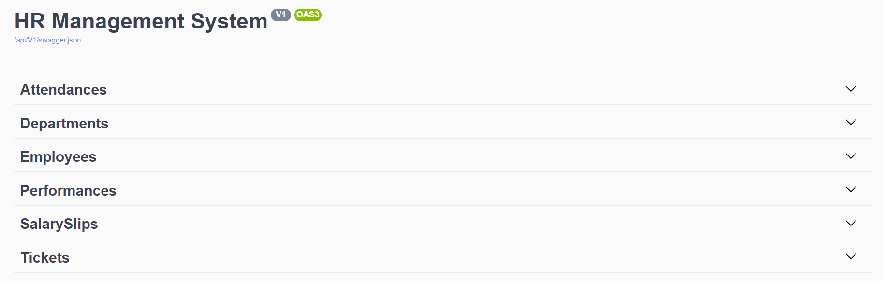
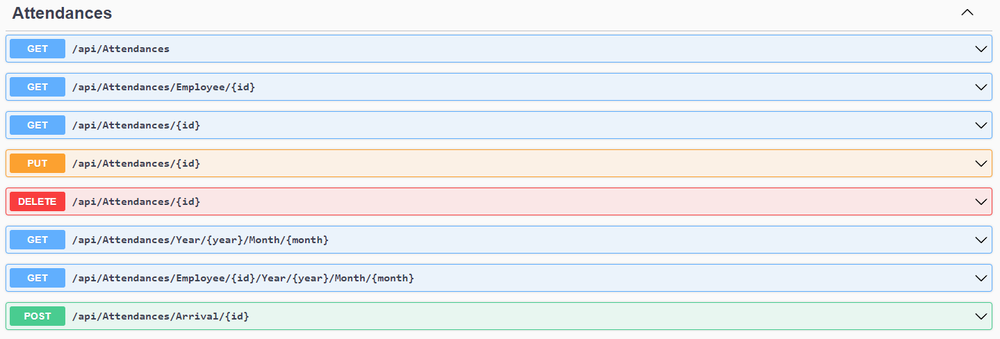
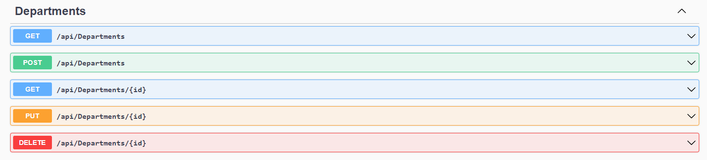
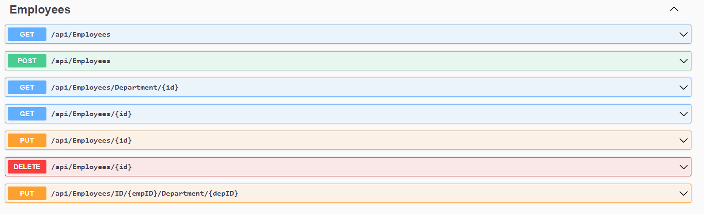
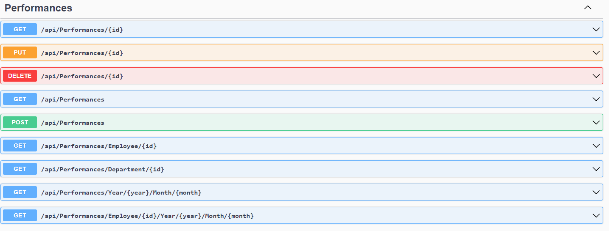
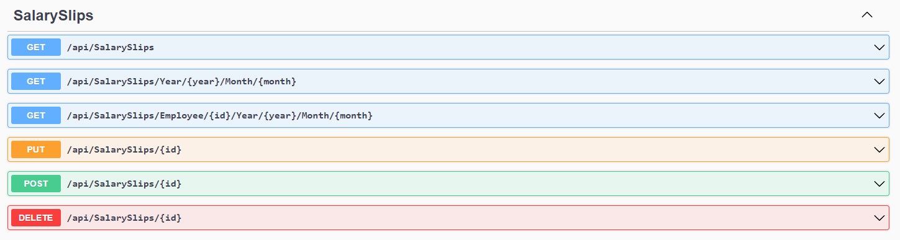
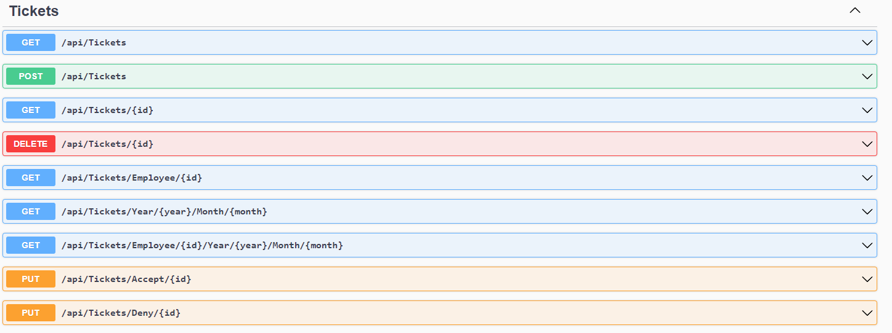

# ***API-Routes***

This file shows all of the routes that this project provides with a brief description on each route and how to use it.  




<br><hr><br>

## ***Attendances-API-Routes***

The Attendance controller has the following routes in it:


```
+ GET: /api/Attendaces
    
    This route allows the user to get all of the attendances that is registered and entered in the database.

+ GET: /api/Attendaces/Employee/{id}

    This route allows the user to get all of the attendances for a specific employee using that employee ID.

+ GET: /api/Attendaces/{id}

    This route allows the user to get a specific attendace report by using the unique ID for that report.

+ PUT: /api/Attendaces/{id}

    This route allows the user to update a specific attendance report by using the id for that specific ID for that report.

+ DELETE: /api/Attendaces/{id}

    This route allows the user to delete a specific attendance report by using the id for that specific ID for that report.

+ GET: /api/Attendaces/Year/{year}/Month/{month}

    This route allows the user to get all of the attendances that is registered and entered in the database in a specific month and year.

+ GET: /api/Attendaces/Employee/{id}/Year/{year}/Month/{month}

    This route allows the user to get all of the attendances for a specific employee that is registered and entered in the database in a specific month and year.

+ POST: /api/Attendaces/Arrival/{id}

    This route allows the user to take his attendance when he arrives to the company by using his ID and it will be saved in the database.
```
<br><hr><br>

## ***Departments-API-Routes***

The Department controller has the following routes in it:


```
+ GET: /api/Depatments

    This route allows the user to view all the deparments in the system with their informantion as well

+ POST: /api/Depatments

    This route allows the user to add a new department to the database.

+ GET: /api/Depatments/{id}

    This route allows the user to get a specific department and all of its informantion by using the department ID.

+ PUT: /api/Depatments/{id}

    This route allows the user to update specific details about a department by using the specific department ID.

+ DELETE: /api/Depatments/{id}

    This route allows the user to delete a certain department and all of its information from the database by using the department ID.
```
<br><hr><br>

## ***Employees-API-Routes***

The Employee controller has the following routes in it:


```
+ GET: /api/Employees

    This route allows the user to view all employees that are registered in the database and view basic information about them.

+ POST: /api/Employees

    This route allows the user to add a new employee to the database.

+ GET: /api/Employees/Department/{id}

    This route allows the user to view all employees that are in a specific department and view basic information about them.

+ GET: /api/Employees/{id}

    This route allows the user to view a certain employee along with their information by using that employee ID.

+ PUT: /api/Employees/{id}

    This route allows the user to update certain details about a specific employee by using that employee ID.

+ DELETE: /api/Employees/{id}

    This route allows the user to delete a certain employee along with their information from the database by using that employee ID.

+ PUT: /api/Employees/ID/{empId}/Department/{depId}

    This route allows the user to update the department that the employee belongs to by using both of the employee ID and the department ID that they are going to be moved to.

```
<br><hr><br>

## ***Performance-API-Routes***

The Performance controller has the following routes in it:


```
+ GET: /api/Performances/{id}

    This route allows the user to view a certain performance report by using the ID for that report.

+ PUT: /api/Employees/{id}

    This route allows the user to update a certain performance report by using the ID for that report.

+ DELETE: /api/Employees/{id}

    This route allows the user to delete a certain performance report by using the ID for that report.

+ GET: /api/Performances

    This route allows the user to view all performance reports.

+ POST: /api/Performances

    This route allows the user to add a new performance report to the database.

+ GET: /api/Performances/Performance/Employee/{id}

    This route allows the user to view all performance reports for a certain employee by using the ID for that employee.

+ GET: /api/Performances/Department/{id}

This route allows the user to view all performance reports for a certain department by using the ID for that department.

+ GET: /api/Performances/year/{year}/month/{month}

    This route allows the user to view all performance reports in a certain month and year.

+ GET: /api/Performances/employee/{id}/year/{year}/month/{month}

    This route allows the user to view all performance reports for a certain employee in a certain month and year.

```

<br><hr><br>

## ***SalarySlips-API-Routes***

The SalarySlip controller has the following routes in it:


```
+ GET: /api/SalarySlips

    This route allows the user to get all salary slips and view their information.

+ GET: /api/SalarySlips/Year/{year}/Month/{month}

    This route allows the user to view all salary slips in a certain month and year.

+ GET: /api/SalarySlips/Employee/{id}/Year{id}/Month/{month}

    This route allows the user to view all salary slips in a certain month and year for a specific employee using that employee ID.

+ PUT: /api/SalarySlips/{id}

    This route allows the user to update specific details about a salaryslip by using the salaryslip ID.

+ POST: /api/SalarySlips/{id}

    This route allows the user to add a new salary slip to the database for a certain employee using the employee ID.

+ Delete: /api/SalarySlips/{id}

    This route allows the user to delete a salary slip from the database using the salaryslip ID.
```
<br><hr><br>

## ***Tickets-API-Routes***

The Tickets controller has the following routes in it:


```
+ GET: /api/Tickets

    This route allows the user to view all tickets that were requested by employees.

+ Post: /api/Tickets

    This route allows the user to add a new ticket to the database.

+ GET: /api/Tickets/{id}

    This route allows the user to view a certain ticket and its information by using the ticket ID.

+ GET: /api/Tickets/Employee/{id}

    This route allows the user to view all tickets requested by a specific employee using that employee ID.

+ GET: /api/Tickets/Year/{year}/Month/{month}

    This route allows the user to view all tickets requested in a specific month and year.

+ GET: /api/Tickets/Employee/{id}/Year/{year}/Month/{month}

    This route allows the user to view all tickets requested by a specific employee using that employee ID in a specific month and year.

+ DELETE: /api/Tickets/{id}

    This route allows the user to delete a certain ticket and its information by using the ticket ID.

+ PUT: /api/Tickets/Accept/{id}

    This route allows the user to update the status of a certain ticket from "Pending" to "Approved" by using the ticket ID.

+ PUT: /api/Tickets/Deny/{id}

    This route allows the user to update the status of a certain ticket from "Pending" to "Denied" by using the ticket ID.


```


