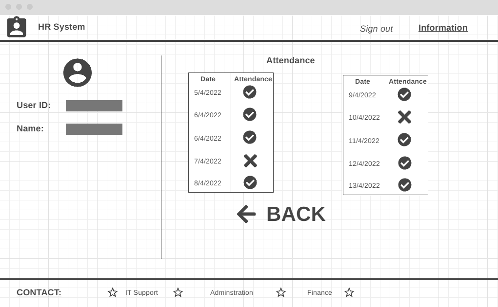
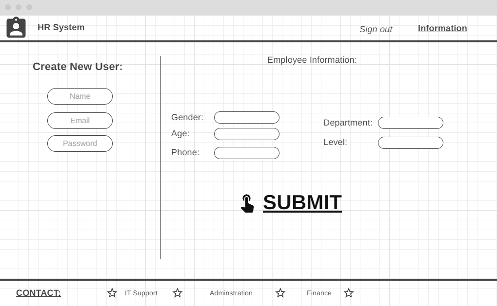
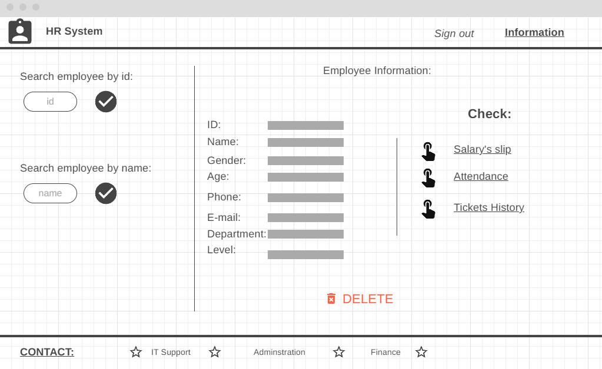
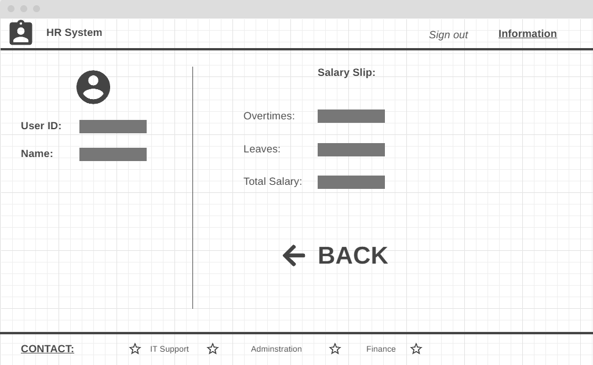
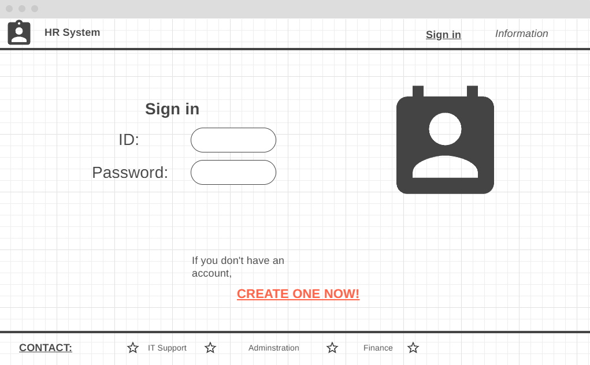
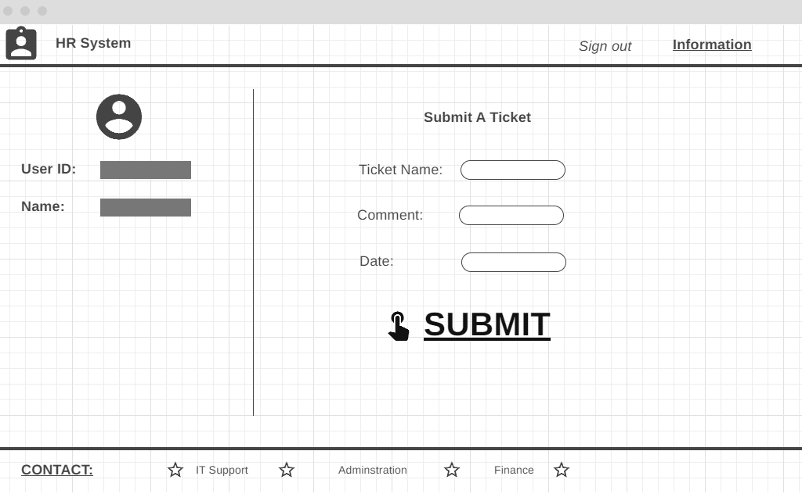

# HR-Management-System

We will create an HR System that has the basic functionality of any HR System which will allow the user to add or remove an employee from the system, view all employees and their basic information along with the ability to view the payroll for each employee, it also allows the user to submit a ticket for leave/overtime along with salary slips. Our project helps us save time so the employees have only to log in and view all the information they need, It dramatically improves reporting & analytics, and the fact that data only has to be entered into the system once has the added benefit of improving data accuracy. 

 
 

## Team Members:
+ Osama Alzaghal.
+ Laith Alalamat.
+ Shadi Aslan.
+ Ahmad Masadeh.
+ Bashar Alrefae.
+ Yousef Qandeel.

 
 

## Wireframes

Attendance Page:

Create New Employee Page:

Get Employee Page:

Pay Roll Page:

Salary Slip Page:

Sign In Page:

Submit Ticket Page:

 
 

## User Stories:

1. We want to go in the website and the landing page will be a page that asks me to log in with a email and password, it also has the option to create a new account

2. As an admin, you can add a new employee to the system, it will ask to add an ID, full name, age, phone number, email, password, department and level

3. When an admin is signed in, he will have the option to search for an employee by their ID and view all of their personal information.

4. each employee have the option to view the salary slips of the employee

5. we will have the option to review the attendence history of the employee

6. as a user you will have the option to raise a ticket for overtime or leaves.

7. as an admin, you will have the option to delete an employee along with their data from the database

 
 